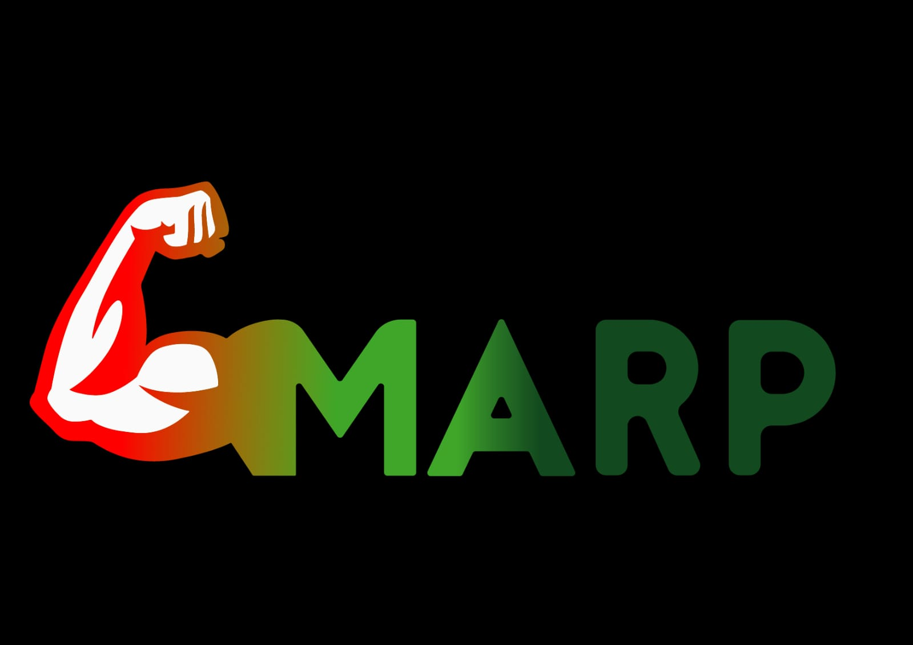

# MARP

## ¿En qué consiste?

#### M.A.R.P (Mechanical Aid Rehabilitation Prototype) es un prototipo de exoesqueleto mecanico que consiste en un sistema de servomecanismos mediante el cual se obtiene un movimiento análogo a la contraccion de la mano. Estos son controlados por un microcontrolador. Tras recibir las señales de los musculos sensados por los electrodos colocados en el brazo, este activaria el protocolo correspondiente para realizar el movimiento deseado. En un principio este movimiento sera abrir y cerrar la mano.
 

## ¿Cuál es nuestro objetivo?

#### El objetivo de M.A.R.P. es asistir fisicamente a personas cuya capacidad motriz ha sido reducida, ya sea por haber sufrido daño nervioso y/o deterioro natural.

## ¿Quienes somos?

#### Somos un entusiasta grupo de 6 alumnos que se encuentran cursando el último año en la Escuela de Educación Secundaria Técnica N°7 (con especialidad en Aviónica) interesados en temas de medicina, biología y tecnología.

## Integrantes:

### NIETO, Matias Ezequiel
    📷 Instagram: matty_nieto
    📧 Email: mattynieto@gmail.com
### MONZÓN, Valentín Jeremias Daniel
    📷 Instagram: valen_monzii
    📧 Email: valenjereda10@gmail.com
### MONZON MATOS, Thomas Esteban 
    📷 Instagram: thomasmonzonmatos
    📧 Email: thomasemonzonm@gmail.com
### PIRILLO, Julian Dante 
    📷 Instagram: urielbenitezz
    📧 Email: unbenitez@gmail.com
### FERNANDEZ IGLESIAS, Juan Ignacion
    📷 Instagram: juani.rvv
    📧 Email: juanignaciofernandez07@gmail.com

## Contacto:
cualquier duda la pueden consultar por:

📧 Email: marpimpatrq@gmail.com
📷 Instagram: marp_impatrq
📞 Telefono: 1161022940

